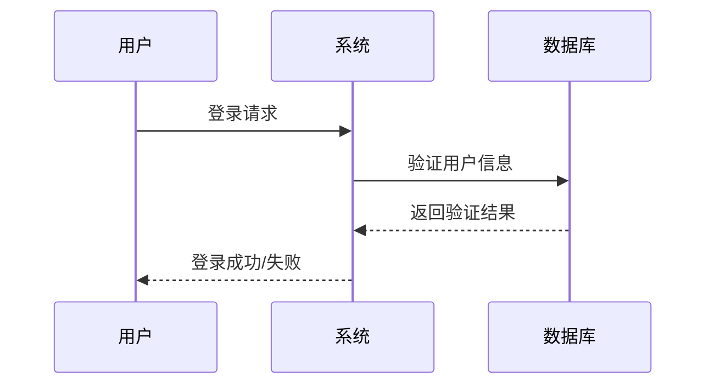

---
nav:
  title: 学习笔记
  order: 0
group:
  title: Android
  order: 3
---

# ICMP
ICMP 全称 Internet Control Message Protocol（互联网控制消息协议）


## 1 特性说明
* OSI 层级：第 3 层（网络层），与 IP 协议同级
* 功能：用于发送错误报告和诊断信息
* 无连接：不建立连接，直接发送消息
* 不可靠：没有错误恢复机制（best-effort）
* 用途：网络诊断、错误报告、网络状态监测

## 2 主要用途
1. Ping（Echo Request/Reply）：最常见的 ICMP 应用，用来测试网络连接是否正常：
    
    发送端 → ICMP Echo Request → 目标主机

    发送端 ← ICMP Echo Reply ← 目标主机
2. Traceroute（追踪路由）：通过发送带有递增 TTL（生存时间）值的 ICMP 包，显示数据包从源到目标的路由路径：

    Host A → Router 1 → Router 2 → Router 3 → Host B

3. 错误报告：当路由器或主机遇到问题时，发送 ICMP 错误消息通知源主机，例如：

    目标不可达（Destination Unreachable）
    
    超时（Time Exceeded）
    
    参数问题（Parameter Problem）


### 2.1 Ping 工作流程


┌─────────────────────────────────────────┐
│ 1. 构造 ICMP Echo Request 包             │
│    Type: 8 (IPv4) or 128 (IPv6)         │
│    Sequence Number: 序列号               │
│    Payload: 可选数据                      │
└─────────────────────────────────────────┘
                 ↓
┌─────────────────────────────────────────┐
│ 2. 通过 Socket 发送 ICMP 包              │
│    Os.write(fileDescriptor, packet)     │
└─────────────────────────────────────────┘
                 ↓
┌─────────────────────────────────────────┐
│ 3. 目标主机收到请求                      │
│    自动生成 Echo Reply 响应               │
│    Type: 0 (IPv4) or 129 (IPv6)         │
└─────────────────────────────────────────┘
                 ↓
┌─────────────────────────────────────────┐
│ 4. 原主机接收响应                        │
│    Os.read(fileDescriptor, reply)       │
│    验证序列号和内容                      │
└─────────────────────────────────────────┘
                 ↓
┌─────────────────────────────────────────┐
│ 5. 计算往返时间 (RTT)                   │
│    RTT = 响应时间 - 发送时间             │
└─────────────────────────────────────────┘

## ICMP包结构
┌─────────────────────────────────────┐
│ Type (8 bits)                       │  0: Echo Reply, 8: Echo Request
├─────────────────────────────────────┤
│ Code (8 bits)                       │  通常为 0
├─────────────────────────────────────┤
│ Checksum (16 bits)                  │  用于错误检测
├─────────────────────────────────────┤
│ Rest of Header (32 bits)            │  Identifier, Sequence Number
├─────────────────────────────────────┤
│ Data (可选)                          │  Payload
└─────────────────────────────────────┘


## 使用ICMP 实现 ping 的优点
轻量级：ICMP 包很小（通常 8 字节起），网络开销小
快速反应：没有连接建立过程，立即返回结果
网络诊断：可以检测网络连接状态、延迟、丢包率
跨平台：几乎所有网络设备都支持 ICMP
不依赖应用层：即使目标主机没有运行特定服务也能响应


## IPv4 vs IPv6 的 ICMP 区别
* IPv4协议：请求类型：8，回复类型：0
* IPv6协议：128，129


## ping代码
```java
public class IcmpCheck implements Runnable, Closeable {
    public static final int ICMPV4_ECHO_REQUEST_TYPE = 8;
    public static final int ICMPV6_ECHO_REQUEST_TYPE = 128;
    private static final int TIMEOUT_SEND = 100;
    private static final int TIMEOUT_RECV = 300;
    private static final int PACKET_BUFSIZE = 512;

    protected final InetAddress mTarget;
    protected final int mAddressFamily;
    protected final VpnPingMeasurement mMeasurement;
    protected FileDescriptor mFileDescriptor;
    protected SocketAddress mSocketAddress;

    private final int mProtocol;
    private final int mIcmpType;
    private final long mTimeout;
    private final int mPingCount;

    protected IcmpCheck(InetAddress target, VpnPingMeasurement long timeout, int pingCount) {
        if (target instanceof Inet6Address) {
            mTarget = target;
            mAddressFamily = OsConstants.AF_INET6;
        } else {
            mTarget = target;
            mAddressFamily = OsConstants.AF_INET;
        }

        this.mTimeout = timeout;
        this.mPingCount = pingCount;
        if (mAddressFamily == AF_INET6) {
            mProtocol = IPPROTO_ICMPV6;
            mIcmpType = ICMPV6_ECHO_REQUEST_TYPE;
        } else {
            mProtocol = IPPROTO_ICMP;
            mIcmpType = ICMPV4_ECHO_REQUEST_TYPE;
        }
    }

    @Override
    public void run() {
        try {
            setupSocket(mProtocol, TIMEOUT_SEND, TIMEOUT_RECV);
            doPing();
        } catch (Exception e) {
            DxLog.e(TAG, "pingError:" + e.getMessage());
        } finally {
            close();
        }
    }

    protected void setupSocket(int protocol, long writeTimeout, long readTimeout)
            throws ErrnoException, IOException {
        mFileDescriptor = Os.socket(mAddressFamily, OsConstants.SOCK_DGRAM, protocol);
        if (Build.VERSION.SDK_INT >= 29) {
            // Setting SNDTIMEO is purely for defensive purposes.
            Os.setsockoptTimeval(mFileDescriptor,
                    OsConstants.SOL_SOCKET, OsConstants.SO_SNDTIMEO, StructTimeval.fromMillis(writeTimeout));
//单次read的超时时间
            Os.setsockoptTimeval(mFileDescriptor,
                    OsConstants.SOL_SOCKET, OsConstants.SO_RCVTIMEO, StructTimeval.fromMillis(readTimeout));
        }
        Os.connect(mFileDescriptor, mTarget, 0);
        mSocketAddress = Os.getsockname(mFileDescriptor);
    }

    private void doPing() {
        // Build a trivial ICMP packet.// ICMP header
        final byte[] icmpPacket = {(byte) mIcmpType, 0, 0, 0, 0, 0, 0, 0};

        int sequence = 0;
        while (sequence < mPingCount) {
            sequence++;
            icmpPacket[icmpPacket.length - 1] = (byte) sequence;
            mMeasurement.sequenceStart();
            try {
                //发送icmp包
                Os.write(mFileDescriptor, icmpPacket, 0, icmpPacket.length);
                //接收icmp包
                checkEcho(sequence);
            } catch (ErrnoException | InterruptedIOException ignore) {
                mMeasurement.sequenceError();
            } finally {
                delay(10);
            }
        }
    }

    private void checkEcho(int sequence) {
        long startTime = SystemClock.elapsedRealtime();
        boolean received = false;
// 可能多次循环：1.主机可能发送多个Reply，可能序列号不对，需要验证icmp序列号；2 网络慢或无响应。
// 单次循环read的超时时间为TIMEOUT_RECV，可以防止read永久阻塞。整体循环的超时时间为mTimeout。可以防止无限制的一直等待。
// 所以需要两个时间
        while (SystemClock.elapsedRealtime() - startTime < mTimeout) {
            try {
                ByteBuffer reply = ByteBuffer.allocate(PACKET_BUFSIZE);
                Os.read(mFileDescriptor, reply);
                //检查icmp包序号
                if (isValidIcmpReply(reply.array(), sequence)) {
                    mMeasurement.sequenceSuccess();
                    received = true;
                    break;
                }
            } catch (ErrnoException | InterruptedIOException ignore) {
                //read failed
            }
        }
        ///超时未接收到正确响应
        if (!received) {
            mMeasurement.sequenceError();
        }
    }

    private boolean isValidIcmpReply(byte[] packet, int expectedSequence) {
        if (mProtocol == IPPROTO_ICMPV6) {
            return packet[0] == -127 &&               // Type: Echo Reply
                    packet[1] == 0 &&               // Code: 0
                    (packet[7] & 0xFF) == expectedSequence; // 序列号匹配
        } else {
            return packet[0] == 0 &&               // Type: Echo Reply
                    packet[1] == 0 &&               // Code: 0
                    (packet[7] & 0xFF) == expectedSequence; // 序列号匹配
        }
    }

    private final Object lock = new Object();

    private void delay(long delay) {
        synchronized (lock) {
            try {
                lock.wait(delay);
            } catch (InterruptedException ignore) {
            }
        }
    }

    @Override
    public void close() {
        if (mFileDescriptor != null && mFileDescriptor.valid()) {
            try {
                Os.close(mFileDescriptor);
            } catch (Exception ignore) {
            }
        }
    }
}


```

## TIMEOUT_SEND send的超时时间含义：
┌──────────────┐
│ 调用 write() │
└──────────────┘
       ↓
┌─────────────────────────────────────────┐
│ 尝试发送 ICMP 包到网络                   │
│                                         │
│ ┌──────────────────────────────────┐   │
│ │ 0ms ──────────── 50ms ──── 100ms │   │
│ │ 开始        ...   ...    超时！  │   │
│ └──────────────────────────────────┘   │
│                                         │
│ 如果 100ms 内还没发送出去，抛出异常     │
└─────────────────────────────────────────┘
何时触发超时：
网络非常拥堵
Socket 缓冲区满
系统资源不足


## TIMEOUT_RECV read超时时间的含义
┌──────────────┐
│ 调用 read()  │
└──────────────┘
       ↓
┌─────────────────────────────────────────┐
│ 等待接收 ICMP Echo Reply                │
│                                         │
│ ┌──────────────────────────────────┐   │
│ │ 0ms ──── 150ms ──── 300ms        │   │
│ │ 开始 收到回复！   或者    超时！  │   │
│ └──────────────────────────────────┘   │
│                                         │
│ 如果 300ms 内没收到，抛出异常           │
└─────────────────────────────────────────┘
何时触发超时：
目标主机无响应（宕机、离线）
网络连接中断
丢包率过高
路由器故障

